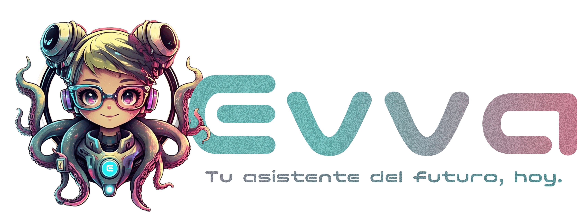

<p align="center">
  
</p>

<h1 align="center">Evva</h1>

<p align="center">
  <strong>Asistente personal con IA, memoria real y acciones proactivas.</strong><br/>
  <em>Vive en Telegram y WhatsApp. Recuerda todo. Actua antes de que lo pidas.</em>
</p>

<p align="center">
  <a href="https://github.com/lacasoft/evva-ai/releases"></a>
  <a href="LICENSE"></a>
  
  
  
  
</p>

<p align="center">
  <a href="README.md">Read in English</a> · <a href="docs/SETUP.es.md">Guia de Setup</a> · <a href="https://github.com/lacasoft/evva-ai/releases">Releases</a>
</p>

<p align="center">
  
</p>

---

## Caracteristicas

| | |
|---|---|
| :brain: **Memoria semantica persistente** -- recuerda todo lo que le cuentas | :bell: **Recordatorios y mensajes proactivos** -- te avisa en el momento justo |
| :memo: **Notas y listas** -- compras, pendientes, wishlists y mas | :busts_in_silhouette: **Gestion de contactos** -- guarda personas y relaciones |
| :calendar: **Google Calendar** -- consulta y crea eventos | :envelope: **Gmail** -- lee, busca y envia correos |
| :credit_card: **Finanzas personales** -- tarjetas, ingresos/gastos, metas de ahorro | :microphone: **Notas de voz** -- transcripcion con Whisper via Groq |
| :camera: **Analisis de fotos** -- Claude Vision para entender imagenes | :sunrise: **Resumen diario** -- briefing matutino proactivo |
| :mag: **Busqueda web** -- resultados actualizados via Brave Search | :cloud: **Clima** -- condiciones actuales de cualquier ciudad |
| :pill: **Seguimiento de medicamentos** -- horarios y dosis | :chart_with_upwards_trend: **Seguimiento de habitos** -- agua, ejercicio, meditacion |
| :sos: **Contactos de emergencia** -- acceso rapido | :page_facing_up: **Analisis de documentos** -- PDFs y archivos via Claude Vision |
| :globe_with_meridians: **Traductor** -- traduccion entre idiomas | :currency_exchange: **Tipo de cambio** -- conversion de divisas en tiempo real |
| :pencil2: **Dictado inteligente** -- mensajes formales o informales | :newspaper: **Resumen de noticias** -- busca y resume noticias actuales |
| :musical_note: **Spotify** -- lo que suena, historial, top tracks | :iphone: **WhatsApp** -- el mismo asistente en WhatsApp Business API |
| :birthday: **Cumpleanos automaticos** -- detecta y recuerda cumpleanos | :stew: **Recetas inteligentes** -- sugerencias segun tu lista del super |
| :zap: **Cache Redis** -- optimiza tokens con cache de OAuth y contexto | :gear: **Modelo LLM configurable** -- Haiku para dev, Sonnet para prod |
| :label: **Rebrandeable** -- cambia el nombre con `APP_BRAND_NAME` | :satellite: **Multi-canal** -- Telegram + WhatsApp con experiencia identica |

---

## Arquitectura

```
Telegram / WhatsApp
        |
        v
+----------------------------------+
|  Gateway (NestJS)                |
|                                  |
|  TelegramModule                  |  <- recibe mensajes, responde
|  ConversationModule              |  <- orquesta el loop del agente
|  MemoryModule                    |  <- RAG sobre facts del usuario
|  PersonaModule                   |  <- system prompt dinamico
|  ToolsModule                     |  <- web_search, reminders, etc.
|  SchedulerModule                 |  <- encola jobs en BullMQ
|  UsersModule                     |  <- CRUD de usuarios y asistentes
+----------------------------------+
           | BullMQ (Redis)
           v
+----------------------------------+
|  Worker (NestJS)                 |
|                                  |
|  ScheduledJobProcessor           |  <- ejecuta recordatorios
|  FactExtractionProcessor         |  <- extrae facts de conversaciones
|  DailyBriefingProcessor          |  <- envia resumenes diarios
+----------------------------------+
           |
           v
+----------------------------------+
|  PostgreSQL + pgvector           |
|                                  |
|  users, assistant_config         |
|  messages, memory_facts          |
|  onboarding_state                |
+----------------------------------+
```

---

## Stack tecnologico

| Capa | Tecnologia |
|---|---|
| Framework | NestJS + TypeScript |
| Bot | grammy |
| LLM | Claude Sonnet (Vercel AI SDK) |
| Embeddings | Voyage AI (voyage-3-lite, 512 dims) |
| Base de datos | PostgreSQL + pgvector |
| Cola de tareas | BullMQ + Redis |
| Transcripcion | Groq (Whisper) |
| Vision | Claude Vision |
| Busqueda | Brave Search API |
| Monorepo | pnpm workspaces |

---

## Inicio rapido

Para instrucciones detalladas paso a paso, consulta [`docs/SETUP.es.md`](docs/SETUP.es.md).

### Prerrequisitos

- Node.js >= 22.0.0
- pnpm >= 9.0.0
- PostgreSQL con extension pgvector
- Redis

### Opcion A -- Docker Compose (recomendado)

```bash
git clone https://github.com/lacasoft/evva-ai.git
cd evva-ai
cp .env.example .env
# Edita .env con tus credenciales (ver .env.example para todas las variables)

docker compose up
```

Listo. PostgreSQL, Redis, migraciones, gateway y worker arrancan automaticamente.

<details>
<summary><strong>Opcion B -- Setup manual</strong></summary>

```bash
git clone https://github.com/lacasoft/evva-ai.git
cd evva-ai
pnpm install
cp .env.example .env
# Edita .env con tus credenciales

pnpm db:migrate

# Terminal 1 -- Gateway (bot de Telegram)
pnpm dev:gateway

# Terminal 2 -- Worker (procesadores de BullMQ)
pnpm dev:worker
```

El bot arranca en modo **long polling** en desarrollo. No necesitas configurar webhooks.

</details>

---

## Directorio de skills

```
packages/skills/src/
├── registry.ts            # Registro central de skills
├── base-skill.ts          # Interfaz SkillDefinition
├── memory/                # Memoria semantica persistente
├── notes/                 # Notas y listas
├── contacts/              # Gestion de contactos
├── reminders/             # Recordatorios programados
├── finance/               # Finanzas personales (tarjetas, transacciones, ahorro)
├── health/                # Seguimiento de medicamentos y habitos
├── emergency/             # Contactos de emergencia
├── calendar/              # Google Calendar
├── gmail/                 # Gmail (leer, buscar, enviar)
├── weather/               # Clima
├── search/                # Busqueda web (Brave)
├── news/                  # Resumen de noticias
├── translator/            # Traduccion entre idiomas
├── exchange/              # Tipo de cambio de divisas
├── dictation/             # Dictado inteligente de mensajes
├── briefing/              # Resumen diario proactivo
├── voice/                 # Transcripcion de notas de voz
└── vision/                # Analisis de fotos y documentos
```

<details>
<summary><strong>Agregar un nuevo skill</strong></summary>

Cada skill es un modulo independiente:

```typescript
// packages/skills/src/mi-skill/index.ts
import { tool } from 'ai';
import { z } from 'zod';
import type { SkillDefinition } from '../base-skill.js';

export const miSkill: SkillDefinition = {
  name: 'mi-skill',
  description: 'Lo que hace este skill',
  category: 'utility',
  forProfiles: ['young', 'adult', 'senior'],
  requiredEnv: ['MI_API_KEY'],  // opcional

  buildTools: (ctx) => ({
    mi_tool: tool({
      description: 'Descripcion para el LLM',
      parameters: z.object({ input: z.string() }),
      execute: async ({ input }) => {
        return { success: true, result: input };
      },
    }),
  }),

  promptInstructions: [
    '- mi_tool: Descripcion de lo que hace esta tool',
  ],
};
```

Registralo en `packages/skills/src/index.ts`:

```typescript
export { miSkill } from './mi-skill/index.js';
import { miSkill } from './mi-skill/index.js';
skillRegistry.register(miSkill);
```

El skill queda disponible automaticamente para el LLM. No hay que modificar ningun otro archivo.

</details>

---

## Tools disponibles

### Productividad

| Tool | Descripcion |
|---|---|
| `save_fact` | Guarda un hecho permanente del usuario en memoria semantica |
| `create_reminder` | Programa un recordatorio para una fecha y hora futura |
| `create_note` | Crea una nota de texto libre o una lista con items |
| `get_notes` | Muestra las notas y listas activas del usuario |
| `update_note` | Modifica, tacha items, archiva o elimina una nota |
| `save_contact` | Guarda un contacto con nombre, telefono, email y relacion |
| `search_contacts` | Busca contactos por nombre o relacion |
| `configure_daily_briefing` | Activa o configura el resumen diario matutino |

### Finanzas

| Tool | Descripcion |
|---|---|
| `add_credit_card` | Registra una tarjeta de credito con fechas de corte y pago |
| `get_credit_cards` | Muestra las tarjetas registradas con saldos |
| `record_transaction` | Registra un ingreso o gasto con categoria y metodo de pago |
| `get_finance_summary` | Resumen financiero del mes: ingresos, gastos y balance |
| `get_recent_transactions` | Lista movimientos recientes con filtros |
| `create_savings_goal` | Crea una meta de ahorro con monto objetivo |
| `get_savings_goals` | Muestra metas de ahorro activas con progreso |
| `calculate_exchange_rate` | Conversion de divisas en tiempo real |

### Comunicacion

| Tool | Descripcion | Requiere |
|---|---|---|
| `connect_google` | Genera link OAuth para conectar Google Calendar y Gmail | OAuth config |
| `list_calendar_events` | Lista proximos eventos del Google Calendar | Google OAuth |
| `create_calendar_event` | Crea un evento en Google Calendar | Google OAuth |
| `list_emails` | Lista correos recientes de Gmail con filtros | Google OAuth |
| `read_email` | Lee el contenido completo de un correo | Google OAuth |
| `send_email` | Envia un correo desde el Gmail del usuario | Google OAuth |
| `translate` | Traduce texto entre idiomas | -- |
| `draft_message` | Genera mensajes formales o informales | -- |

### Salud

| Tool | Descripcion |
|---|---|
| `add_medication` | Registra un medicamento con horarios y dosis |
| `get_medications` | Muestra medicamentos activos |
| `create_habit` | Crea un habito para trackear diariamente |
| `log_habit` | Registra progreso en un habito |
| `get_habit_progress` | Muestra progreso de habitos de hoy |
| `add_emergency_contact` | Registra un contacto de emergencia |
| `get_emergency_contacts` | Muestra contactos de emergencia |

### Utilidad

| Tool | Descripcion | Requiere |
|---|---|---|
| `web_search` | Busqueda web actualizada | `BRAVE_SEARCH_API_KEY` |
| `get_weather` | Clima actual de cualquier ciudad | -- |
| `summarize_news` | Busca y resume noticias actuales | `BRAVE_SEARCH_API_KEY` |

---

## Optimizacion de tokens

Evva esta disenado para minimizar el consumo de tokens por mensaje:

| Optimizacion | Antes | Despues | Ahorro |
|---|---|---|---|
| Ventana de historial | 12 mensajes | 6 mensajes | ~480 tokens |
| maxSteps (rondas de tool calls) | 3 | 2 | ~5,400 tokens |
| System prompt (bloque de comportamiento) | 225 tokens | 80 tokens | ~145 tokens |
| Filtro de skills OAuth | 42 tools siempre cargadas | Solo tools conectadas | ~2,000 tokens |
| Query de providers | 2 llamadas DB por mensaje | 1 llamada cacheada (Redis 5min) | Latencia |
| Skill registry | Checa env vars en cada llamada | Cache despues de la primera | CPU |

**Reduccion estimada: ~55% (de ~23K a ~10K tokens por mensaje)**

```
Antes:   [system prompt ~1,400] + [42 tool schemas ~3,000] + [historial ~960] x 3 steps = ~23,000 tokens
Despues: [system prompt ~1,200] + [~20 tool schemas ~1,500] + [historial ~480] x 2 steps = ~10,000 tokens
```

---

## Configuracion

### Variables requeridas

| Variable | Donde obtenerla |
|---|---|
| `TELEGRAM_BOT_TOKEN` | [@BotFather](https://t.me/BotFather) en Telegram |
| `ANTHROPIC_API_KEY` | [console.anthropic.com](https://console.anthropic.com) |
| `VOYAGE_API_KEY` | [dash.voyageai.com](https://dash.voyageai.com) |
| `DATABASE_URL` | `postgresql://localhost:5432/evva` en desarrollo |
| `REDIS_URL` | `redis://localhost:6379` en desarrollo |

### Variables opcionales

| Variable | Proposito |
|---|---|
| `BRAVE_SEARCH_API_KEY` | Busqueda web ([brave.com/search/api](https://brave.com/search/api/)) |
| `GROQ_API_KEY` | Transcripcion de audio con Whisper |
| `GOOGLE_CLIENT_ID` | Integracion con Google Calendar y Gmail |
| `GOOGLE_CLIENT_SECRET` | Integracion con Google Calendar y Gmail |
| `APP_BRAND_NAME` | Nombre personalizado del asistente (default: "Evva") |
| `LLM_MODEL` | Sobreescribir el modelo de Claude por defecto |
| `TELEGRAM_WEBHOOK_URL` | Solo produccion |
| `TELEGRAM_SECRET_TOKEN` | Solo produccion -- generar con `openssl rand -hex 32` |

---

## Contribuir

Las contribuciones son bienvenidas:

1. Haz fork del repositorio y crea una rama para tu feature.
2. Escribe tests para cualquier funcionalidad nueva.
3. Asegurate de que `pnpm test` y `pnpm lint` pasen sin errores.
4. Haz commits enfocados con mensajes claros.
5. Abre un Pull Request describiendo que cambiaste y por que.

Para bugs y feature requests, abre un issue.

---

## Licencia

Este proyecto esta bajo la [Licencia MIT](LICENSE).

---

<p align="center">
  Hecho por <a href="https://laca-soft.com">LACA-SOFT</a> · <a href="https://github.com/lacasoft">GitHub</a>
</p>
